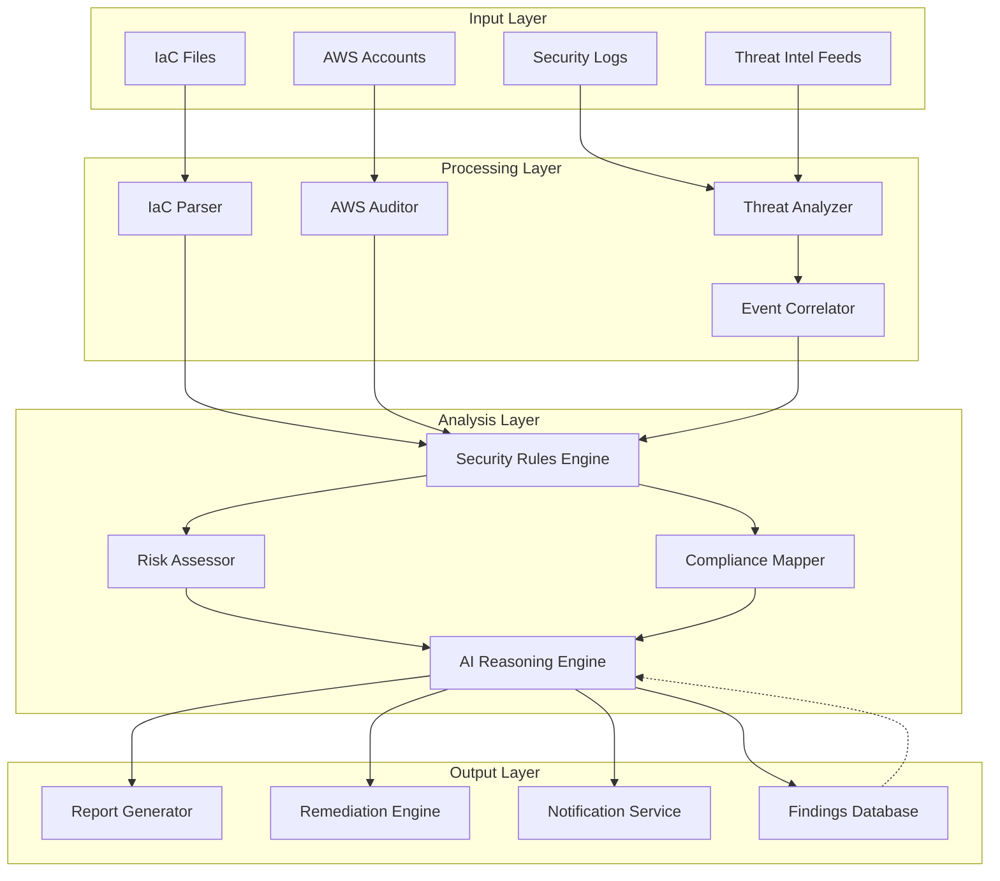

# Infrastructure Security Review Agent - Design Document

## Overview

The Infrastructure Security Review Agent is a comprehensive security analysis system that evaluates AWS cloud infrastructure through multiple lenses: static IaC analysis, live environment auditing, threat detection, compliance mapping, and AI-driven remediation. The agent operates as a modular, extensible system that can be invoked through CLI, API, or integrated into CI/CD pipelines.

### Core Capabilities

1. **Static Analysis Engine**: Parses and analyzes IaC files (Terraform, CloudFormation, CDK)
2. **Live Environment Auditor**: Connects to AWS accounts to audit runtime configurations
3. **Threat Intelligence Analyzer**: Correlates security events and vulnerability data
4. **Compliance Mapper**: Maps findings to regulatory frameworks
5. **Remediation Generator**: Produces actionable fixes and automated PRs
6. **Learning System**: Improves detection accuracy over time

## Architecture

### High-Level Architecture



### Component Architecture

The system follows a layered architecture with clear separation of concerns:

1. **Input Adapters**: Handle different input sources (IaC files, AWS APIs, log streams)
2. **Parsers & Collectors**: Transform raw data into normalized internal representations
3. **Analysis Engines**: Apply security rules, compliance checks, and threat detection
4. **AI Reasoning Layer**: Provides context-aware analysis and recommendations
5. **Output Generators**: Produce reports, remediation code, and notifications

## Components and Interfaces

### 1. IaC Parser Module

**Purpose**: Parse and normalize Infrastructure-as-Code files from multiple formats.

**Interfaces**:

```typescript
interface IaCParser {
  parse(filePath: string, format: IaCFormat): Promise<ParsedInfrastructure>;
  validate(parsed: ParsedInfrastructure): ValidationResult;
  extractResources(parsed: ParsedInfrastructure): Resource[];
}

enum IaCFormat {
  TERRAFORM = 'terraform',
  CLOUDFORMATION = 'cloudformation',
  CDK = 'cdk'
}

interface ParsedInfrastructure {
  format: IaCFormat;
  resources: Resource[];
  variables: Variable[];
  outputs: Output[];
  metadata: Metadata;
}

interface Resource {
  id: string;
  type: string;
  properties: Record<string, any>;
  dependencies: string[];
  location: SourceLocation;
}
```

**Implementation Strategy**:
- Use HCL parser for Terraform (e.g., `hcl2-parser`)
- Use CloudFormation template parser for CFN (AWS SDK)
- Use TypeScript AST analysis for CDK (TypeScript compiler API)
- Normalize all formats to common `Resource` representation

### 2. AWS Auditor Module

**Purpose**: Connect to AWS accounts and collect live resource configurations.

**Interfaces**:

```typescript
interface AWSAuditor {
  connect(credentials: AWSCredentials): Promise<void>;
  listAccounts(): Promise<AWSAccount[]>;
  auditAccount(accountId: string): Promise<AccountAudit>;
  auditService(accountId: string, service: AWSService): Promise<ServiceAudit>;
  detectDrift(iacResources: Resource[], liveResources: Resource[]): DriftReport;
}

interface AWSCredentials {
  accessKeyId?: string;
  secretAccessKey?: string;
  sessionToken?: string;
  profile?: string;
  roleArn?: string;
}

interface AccountAudit {
  accountId: string;
  regions: RegionAudit[];
  organizations: OrganizationAudit;
  identity: IdentityAudit;
  securityServices: SecurityServicesAudit;
}

interface ServiceAudit {
  service: AWSService;
  resources: Resource[];
  findings: Finding[];
}
```

**Implementation Strategy**:
- Use AWS SDK v3 for all AWS API calls
- Implement parallel region scanning for performance
- Support AWS Organizations for multi-account enumeration
- Cache API responses to minimize API calls
- Support assume-role for cross-account access

### 3. Security Rules Engine

**Purpose**: Apply security rules to detect misconfigurations and vulnerabilities.

**Interfaces**:

```typescript
interface SecurityRulesEngine {
  loadRules(ruleSet: RuleSet): void;
  analyze(resources: Resource[]): Finding[];
  evaluateRule(rule: SecurityRule, resource: Resource): RuleResult;
  customizeRule(ruleId: string, customization: RuleCustomization): void;
}

interface SecurityRule {
  id: string;
  name: string;
  description: string;
  severity: Severity;
  category: Category;
  frameworks: ComplianceFramework[];
  condition: RuleCondition;
  remediation: RemediationGuidance;
}

interface Finding {
  id: string;
  ruleId: string;
  resource: Resource;
  severity: Severity;
  title: string;
  description: string;
  evidence: Evidence;
  remediation: RemediationGuidance;
  complianceMapping: ComplianceMapping[];
}

enum Severity {
  CRITICAL = 'critical',
  HIGH = 'high',
  MEDIUM = 'medium',
  LOW = 'low',
  INFO = 'info'
}
```

**Rule Categories**:
- IAM & Identity
- Network Security
- Data Protection & Encryption
- Logging & Monitoring
- Compute Security
- Storage Security
- Database Security
- Container Security
- API Security

**Implementation Strategy**:
- Define rules in declarative YAML/JSON format
- Support custom rule development
- Implement rule engine using pattern matching
- Pre-load CIS, AWS Well-Architected, and custom rule sets
- Support rule severity overrides per environment

### 4. Threat Intelligence Analyzer

**Purpose**: Analyze security logs and correlate with threat intelligence.

**Interfaces**:

```typescript
interface ThreatAnalyzer {
  analyzeLogs(logSource: LogSource): Promise<ThreatFinding[]>;
  correlateEvents(events: SecurityEvent[]): CorrelatedThreat[];
  checkVulnerabilities(component: Component): Promise<Vulnerability[]>;
  enrichWithThreatIntel(finding: Finding): Promise<EnrichedFinding>;
}

interface LogSource {
  type: LogType;
  location: string;
  timeRange: TimeRange;
}

enum LogType {
  CLOUDTRAIL = 'cloudtrail',
  VPC_FLOW = 'vpc_flow',
  GUARDDUTY = 'guardduty',
  SECURITY_HUB = 'security_hub',
  CONFIG = 'config'
}

interface CorrelatedThreat {
  id: string;
  events: SecurityEvent[];
  attackPattern: AttackPattern;
  severity: Severity;
  timeline: Timeline;
  affectedResources: Resource[];
}

interface Vulnerability {
  cve: string;
  component: string;
  version: string;
  severity: Severity;
  exploitability: number;
  threatIntel: ThreatIntelligence;
}
```

**Implementation Strategy**:
- Integrate with AWS CloudTrail, GuardDuty, Security Hub APIs
- Parse VPC Flow Logs from S3
- Implement event correlation using time-window analysis
- Query CVE databases (NVD, CISA KEV)
- Use ML-based anomaly detection for unusual patterns
- Maintain threat intelligence cache with periodic updates

### 5. Compliance Mapper

**Purpose**: Map security findings to compliance frameworks.

**Interfaces**:

```typescript
interface ComplianceMapper {
  mapFinding(finding: Finding): ComplianceMapping[];
  generateReport(findings: Finding[], framework: ComplianceFramework): ComplianceReport;
  assessCompliance(findings: Finding[]): ComplianceScore;
}

interface ComplianceMapping {
  framework: ComplianceFramework;
  controlId: string;
  controlName: string;
  requirement: string;
  status: ComplianceStatus;
}

enum ComplianceFramework {
  CIS_AWS = 'cis_aws_foundations',
  AWS_WELL_ARCHITECTED = 'aws_well_architected',
  ISO_27001 = 'iso_27001',
  NIST_800_53 = 'nist_800_53',
  PCI_DSS = 'pci_dss',
  HIPAA = 'hipaa',
  SOC2 = 'soc2'
}

enum ComplianceStatus {
  COMPLIANT = 'compliant',
  NON_COMPLIANT = 'non_compliant',
  PARTIAL = 'partial',
  NOT_APPLICABLE = 'not_applicable'
}

interface ComplianceReport {
  framework: ComplianceFramework;
  overallScore: number;
  controls: ControlAssessment[];
  summary: ComplianceSummary;
  timestamp: Date;
}
```

**Implementation Strategy**:
- Maintain mapping database between rules and framework controls
- Support multiple framework versions
- Generate framework-specific reports
- Track compliance trends over time
- Support custom framework definitions

### 6. AI Reasoning Engine

**Purpose**: Provide context-aware analysis, risk assessment, and intelligent recommendations.

**Interfaces**:

```typescript
interface AIReasoningEngine {
  analyzeArchitecture(resources: Resource[]): ArchitectureInsight;
  assessRisk(finding: Finding, context: SecurityContext): RiskAssessment;
  generateRemediation(finding: Finding): RemediationPlan;
  explainInBusinessTerms(finding: Finding): BusinessImpactExplanation;
  learnFromFeedback(feedback: Feedback): void;
}

interface ArchitectureInsight {
  dataFlows: DataFlow[];
  attackSurfaces: AttackSurface[];
  trustBoundaries: TrustBoundary[];
  criticalPaths: CriticalPath[];
}

interface RiskAssessment {
  finding: Finding;
  likelihood: number;
  impact: number;
  riskScore: number;
  businessImpact: BusinessImpact;
  attackScenarios: AttackScenario[];
}

interface RemediationPlan {
  finding: Finding;
  steps: RemediationStep[];
  automatedFix: AutomatedFix;
  estimatedEffort: string;
  priority: number;
}

interface BusinessImpactExplanation {
  finding: Finding;
  businessRisk: string;
  affectedAssets: string[];
  potentialConsequences: string[];
  regulatoryImplications: string[];
}
```

**Implementation Strategy**:
- Use graph analysis to understand resource relationships
- Implement risk scoring algorithm combining CVSS, business context, and exploitability
- Generate remediation using template-based and LLM-assisted approaches
- Maintain knowledge base of common patterns and fixes
- Store feedback loop data for continuous improvement

### 7. Remediation Engine

**Purpose**: Generate actionable remediation code and automate fixes.

**Interfaces**:

```typescript
interface RemediationEngine {
  generateFix(finding: Finding, format: IaCFormat): FixedCode;
  createPullRequest(fixes: FixedCode[], repo: Repository): Promise<PullRequest>;
  applyFix(fix: FixedCode, target: Target): Promise<ApplyResult>;
  validateFix(fix: FixedCode): ValidationResult;
}

interface FixedCode {
  finding: Finding;
  original: string;
  fixed: string;
  diff: string;
  explanation: string;
}

interface PullRequest {
  id: string;
  title: string;
  description: string;
  branch: string;
  files: FileChange[];
  url: string;
}

interface AutomatedFix {
  applicable: boolean;
  code: string;
  testable: boolean;
  reversible: boolean;
}
```

**Implementation Strategy**:
- Generate IaC fixes using AST manipulation
- Support Git integration (GitHub, GitLab, Bitbucket)
- Create descriptive PR descriptions with security rationale
- Include before/after comparisons
- Support dry-run mode for validation

### 8. Report Generator

**Purpose**: Generate comprehensive security reports in multiple formats.

**Interfaces**:

```typescript
interface ReportGenerator {
  generateExecutiveSummary(findings: Finding[]): ExecutiveSummary;
  generateDetailedReport(findings: Finding[]): DetailedReport;
  exportReport(report: Report, format: ReportFormat): Promise<string>;
  generateDashboard(findings: Finding[]): Dashboard;
}

enum ReportFormat {
  PDF = 'pdf',
  HTML = 'html',
  JSON = 'json',
  CSV = 'csv',
  MARKDOWN = 'markdown'
}

interface ExecutiveSummary {
  overallRiskScore: number;
  criticalFindings: number;
  topRisks: Finding[];
  complianceStatus: ComplianceScore;
  trends: Trend[];
  recommendations: string[];
}

interface DetailedReport {
  summary: ExecutiveSummary;
  findingsByService: Map<string, Finding[]>;
  findingsBySeverity: Map<Severity, Finding[]>;
  complianceReports: ComplianceReport[];
  remediationPlan: RemediationPlan[];
  appendix: Appendix;
}
```

**Implementation Strategy**:
- Use templating engine for report generation
- Support customizable report templates
- Generate visualizations using charting library
- Export to multiple formats (PDF via Puppeteer, CSV, JSON)
- Include executive and technical views

### 9. Notification Service

**Purpose**: Send alerts and notifications to external systems.

**Interfaces**:

```typescript
interface NotificationService {
  sendNotification(finding: Finding, channels: NotificationChannel[]): Promise<void>;
  createTicket(finding: Finding, ticketSystem: TicketSystem): Promise<Ticket>;
  configureIntegration(integration: Integration): void;
}

interface NotificationChannel {
  type: ChannelType;
  config: ChannelConfig;
  filter: NotificationFilter;
}

enum ChannelType {
  SLACK = 'slack',
  EMAIL = 'email',
  JIRA = 'jira',
  PAGERDUTY = 'pagerduty',
  WEBHOOK = 'webhook'
}

interface NotificationFilter {
  minSeverity: Severity;
  services: string[];
  environments: string[];
}
```

**Implementation Strategy**:
- Support multiple notification channels
- Implement severity-based filtering
- Use webhook for custom integrations
- Support notification templates
- Implement rate limiting and deduplication

### 10. Findings Database

**Purpose**: Store and retrieve historical findings for trend analysis and learning.

**Interfaces**:

```typescript
interface FindingsDatabase {
  store(findings: Finding[]): Promise<void>;
  query(criteria: QueryCriteria): Promise<Finding[]>;
  getTrends(timeRange: TimeRange): Promise<Trend[]>;
  getHistory(resourceId: string): Promise<Finding[]>;
}

interface QueryCriteria {
  severity?: Severity[];
  services?: string[];
  timeRange?: TimeRange;
  status?: FindingStatus[];
  frameworks?: ComplianceFramework[];
}

interface Trend {
  metric: string;
  dataPoints: DataPoint[];
  direction: TrendDirection;
}
```

**Implementation Strategy**:
- Use SQLite for local storage or PostgreSQL for production
- Index by resource, severity, timestamp
- Support time-series queries for trends
- Implement data retention policies
- Export/import capabilities for backup

## Data Models

### Core Data Models

```typescript
// Resource Model
interface Resource {
  id: string;
  type: string;
  service: string;
  region: string;
  account: string;
  properties: Record<string, any>;
  tags: Record<string, string>;
  relationships: Relationship[];
  source: ResourceSource;
  timestamp: Date;
}

enum ResourceSource {
  IAC = 'iac',
  LIVE = 'live',
  BOTH = 'both'
}

// Finding Model
interface Finding {
  id: string;
  ruleId: string;
  resource: Resource;
  severity: Severity;
  category: Category;
  title: string;
  description: string;
  evidence: Evidence;
  remediation: RemediationGuidance;
  complianceMapping: ComplianceMapping[];
  riskScore: number;
  status: FindingStatus;
  createdAt: Date;
  updatedAt: Date;
}

enum FindingStatus {
  OPEN = 'open',
  IN_PROGRESS = 'in_progress',
  RESOLVED = 'resolved',
  ACCEPTED_RISK = 'accepted_risk',
  FALSE_POSITIVE = 'false_positive'
}

// Security Context Model
interface SecurityContext {
  environment: Environment;
  dataClassification: DataClassification;
  businessCriticality: BusinessCriticality;
  complianceRequirements: ComplianceFramework[];
  threatModel: ThreatModel;
}

enum Environment {
  PRODUCTION = 'production',
  STAGING = 'staging',
  DEVELOPMENT = 'development',
  TEST = 'test'
}

enum DataClassification {
  PUBLIC = 'public',
  INTERNAL = 'internal',
  CONFIDENTIAL = 'confidential',
  RESTRICTED = 'restricted'
}

// Configuration Model
interface AgentConfig {
  aws: AWSConfig;
  rules: RulesConfig;
  compliance: ComplianceConfig;
  notifications: NotificationConfig;
  integrations: IntegrationConfig;
  output: OutputConfig;
}
```

## Error Handling

### Error Categories

1. **Input Errors**: Invalid IaC syntax, missing files, inaccessible AWS accounts
2. **API Errors**: AWS API throttling, permission denied, service unavailable
3. **Analysis Errors**: Rule execution failures, parsing errors
4. **Output Errors**: Report generation failures, notification delivery failures

### Error Handling Strategy

```typescript
class SecurityAgentError extends Error {
  constructor(
    message: string,
    public code: ErrorCode,
    public category: ErrorCategory,
    public recoverable: boolean,
    public context?: any
  ) {
    super(message);
  }
}

enum ErrorCode {
  IAC_PARSE_ERROR = 'IAC_PARSE_ERROR',
  AWS_AUTH_ERROR = 'AWS_AUTH_ERROR',
  AWS_API_ERROR = 'AWS_API_ERROR',
  RULE_EXECUTION_ERROR = 'RULE_EXECUTION_ERROR',
  REPORT_GENERATION_ERROR = 'REPORT_GENERATION_ERROR',
  NOTIFICATION_ERROR = 'NOTIFICATION_ERROR'
}

interface ErrorHandler {
  handle(error: SecurityAgentError): ErrorHandlingResult;
  retry(operation: () => Promise<any>, maxRetries: number): Promise<any>;
  logError(error: SecurityAgentError): void;
}
```

**Error Handling Principles**:
- Fail gracefully with partial results when possible
- Implement exponential backoff for API rate limiting
- Log all errors with context for debugging
- Provide clear error messages to users
- Continue analysis even if individual resources fail
- Aggregate errors in final report

## Testing Strategy

### Unit Testing

- Test each module independently with mocked dependencies
- Test rule engine with known good/bad configurations
- Test parsers with sample IaC files
- Test compliance mapper with known control mappings
- Target: 80%+ code coverage

### Integration Testing

- Test IaC parser → Rules Engine → Report Generator flow
- Test AWS Auditor → Rules Engine → Findings Database flow
- Test end-to-end analysis with sample infrastructure
- Test notification delivery to mock endpoints
- Test PR creation with test repositories

### Security Testing

- Test with intentionally vulnerable IaC configurations
- Validate that all CIS benchmark violations are detected
- Test with real-world misconfiguration examples
- Verify no false negatives on critical issues
- Test AWS credential handling security

### Performance Testing

- Test with large IaC codebases (1000+ resources)
- Test multi-account scanning (10+ accounts)
- Test log analysis with high-volume CloudTrail data
- Measure and optimize API call efficiency
- Test parallel processing capabilities

### Compliance Testing

- Verify all CIS AWS Foundations controls are covered
- Validate compliance report accuracy
- Test framework mapping completeness
- Verify remediation recommendations are correct

## Deployment Architecture

### CLI Tool

```bash
# Installation
npm install -g @security/infra-agent

# Usage
infra-agent scan --iac ./terraform --output report.pdf
infra-agent audit --profile prod --regions us-east-1,us-west-2
infra-agent compliance --framework cis --format json
```

### CI/CD Integration

```yaml
# GitHub Actions Example
- name: Security Review
  uses: security/infra-agent-action@v1
  with:
    iac-path: ./infrastructure
    fail-on-severity: high
    output-format: json
```

### API Service

```typescript
// REST API
POST /api/v1/scan
POST /api/v1/audit
GET /api/v1/findings
GET /api/v1/reports/:id
POST /api/v1/remediate
```

### Docker Container

```dockerfile
FROM node:18-alpine
COPY . /app
WORKDIR /app
RUN npm install
ENTRYPOINT ["node", "dist/cli.js"]
```

## Configuration Management

### Configuration File Structure

```yaml
# .infra-agent.yml
aws:
  profiles:
    - name: production
      role_arn: arn:aws:iam::123456789:role/SecurityAudit
      regions: [us-east-1, us-west-2]
  
rules:
  enabled_rulesets:
    - cis-aws-foundations
    - aws-well-architected
    - custom
  severity_overrides:
    - rule_id: IAM-001
      severity: critical
  
compliance:
  frameworks:
    - cis_aws_foundations
    - nist_800_53
  
notifications:
  slack:
    webhook_url: ${SLACK_WEBHOOK}
    min_severity: high
  jira:
    url: ${JIRA_URL}
    project: SEC
    min_severity: critical

integrations:
  git:
    provider: github
    token: ${GITHUB_TOKEN}
    auto_pr: true

output:
  formats: [pdf, json, csv]
  destination: ./reports
  include_remediation: true
```

## Performance Considerations

1. **Parallel Processing**: Scan multiple regions and accounts in parallel
2. **Caching**: Cache AWS API responses and parsed IaC
3. **Incremental Analysis**: Only analyze changed resources
4. **Lazy Loading**: Load rules and threat intel on-demand
5. **Batch Operations**: Batch AWS API calls where possible
6. **Resource Limits**: Implement memory and time limits for large scans

## Security Considerations

1. **Credential Management**: Support AWS credential chain, never log credentials
2. **Least Privilege**: Require only read-only AWS permissions
3. **Data Privacy**: Sanitize sensitive data in reports and logs
4. **Secure Storage**: Encrypt findings database at rest
5. **Audit Trail**: Log all agent actions for accountability
6. **Supply Chain**: Verify dependencies and use lock files

## Extensibility

### Plugin System

```typescript
interface SecurityPlugin {
  name: string;
  version: string;
  initialize(config: PluginConfig): Promise<void>;
  getRules(): SecurityRule[];
  getAnalyzers(): Analyzer[];
  getReporters(): Reporter[];
}

// Example custom plugin
class CustomCompliancePlugin implements SecurityPlugin {
  name = 'custom-compliance';
  version = '1.0.0';
  
  getRules(): SecurityRule[] {
    return [
      // Custom organization-specific rules
    ];
  }
}
```

### Custom Rule Development

```yaml
# custom-rules/no-public-s3.yml
id: CUSTOM-S3-001
name: No Public S3 Buckets
description: S3 buckets must not allow public access
severity: critical
category: storage
service: s3
condition:
  resource_type: aws_s3_bucket
  any:
    - property: acl
      equals: public-read
    - property: acl
      equals: public-read-write
remediation:
  description: Set bucket ACL to private
  code: |
    resource "aws_s3_bucket" "example" {
      acl = "private"
    }
```

## Future Enhancements

1. **Multi-Cloud Support**: Extend to Azure, GCP
2. **Real-Time Monitoring**: Continuous monitoring mode
3. **Automated Remediation**: Auto-apply fixes with approval workflow
4. **ML-Based Anomaly Detection**: Advanced threat detection
5. **Cost Optimization**: Identify security-related cost savings
6. **Compliance Automation**: Auto-generate compliance evidence
7. **Integration Marketplace**: Pre-built integrations with security tools
8. **Mobile Dashboard**: Mobile app for security metrics
